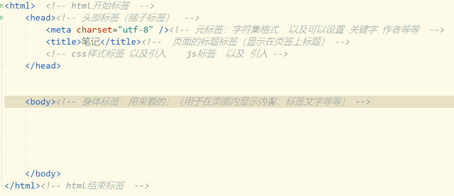

# Note 240618

## Review
- 
- 

### HTML 的基本结构
- 

### HTML 
- 图片标签（image）
  - 用来在页面中引入图片资源。
  - src属性：图片所在的相对或绝对位置。
  - align属性:设置文本中的图像的对齐方式。
    - 后期用 css 样式去处理
  - alt属性：用来为图像定义预备的可替换的文本。
  - title属性：用来为图片提示文本。
    - 不是 img 的专属,任何标签都可以加
  - width : 宽度
  - height : 高度
  - ``
- 跑马灯
  - 了解
  - `<marquee>Hello, World</marquee>`
  - 事件
    - onMouseOut="this.start()" 当鼠标移出该区域时 
    - onMouseOver="this.stop()" 当鼠标移入该区域时
      - 结合了  js的知识点： 触发事件   
      - onmouseover  鼠标覆盖到当前的标签上会触发
      - onmouseover  鼠标移开到当前的标签上会触发
      - this 当前本身（当前对象：当前的标签）
      - stop()  停止（不动）
      - start() 开始（继续滚动）
    - 
  - 属性
    - behavior : alternate:来回滚动 scroll:重复滚动  slide:不重复滚动
    - bgcolor : 活动字幕的背景颜色
    - direction : left right up down
    - height : 设定活动字幕的高度
    - width : 设定活动字幕的宽度
    - Loop : 设定滚动的次数，当loop=-1表示一直滚动下去，默认为-1
    - scrollamount : 设定活动字幕的滚动速度（像素）
      - 默认在 6 左右  , 数字越大,越慢 
    - scrolldelay : 设定活动字幕滚动两次之间的延迟时间（毫秒）
      - 数字越大 越慢
- 列表
  - 有序列表：用来显示有顺序的列表数据信息，可显示顺序号。
  - 
    - ol标签：有序列表
      - li标签: 有序列表项
        - type属性：规定列表的项目符号的类型，取值范围：A、a、1、i、Ι。
  - 无序列表：用来显示无顺序的列表数据信息，可以设置列表符号。
    - 无序不是乱序 只是没有序列数而已 , 取代的是 图标 标记
    - 
      - ul标签：无序列表，块级元素
        - li标签:有序列表明细项，块级元素。
          - type属性：列表的明细符号类型，取值范围 circle(空心圆)、disc(实心圆)、square(正方形)
  - 定义列表
    - 以<dl>标签是实现
    - 以<dt>标签定义列表项
    - 以<dd>标签定义内容
- 表格
  - `<table>` 表格标签
    - `<tr>` 行标签
      - `<td>` 普通单元格 左对齐
      - `<th>` 特殊单元格 表格标题标签 加粗 居中
  - 只做了解的标签
    - table标签：表格标签
    - caption标签：表格标题
    - thead标签：表头单元格容器。
    - tbody标签：表体单元格容器
    - tfoot标签：表尾单元格容器
  - 表格的合并 (属性)
    - 行合并
      - colspan
    - 列合并
      - rowspan
  - 属性
    - border(边框)属性：border=“number”
      - bordercolor , 对应的是整个表的边框颜色
    - background(背景)属性： background =“背景图片”
    - bgcolor(背景颜色)属性：bgcolor = “颜色”
    - width、height属性：width= “300”height=“200”
    - align:(水平对齐) 表格的位置由<table>元素的align属性决定，可选值包括left、center、right。
    - valign:(垂直对齐)表格内文字的位置是由<td>的align和valign决定的，valign可选值包括top、middle、bottom。
    - cellpadding(填充)(内边距)属性:设置单元格之间的距离。
    - cellspacing(间距)(外间距)属性:设置单元格边框与内容之间的距离
  - 注意 : 
    - table结构 基本是固定的 不要在单元格外放任何数据，否则它只会显示在表格外面
- 表单
  - 表单标签的基本作用：封装客户端输入的数据，并通过设定以指定的模式将数据提交给服务器端。
  - 表单标签介绍
    - form标签：表单元素（其余标签）标签的容器标签
      - form 表单没有实际显示
      - 属性
        - action=“数据要提交的地址”
        - method=“提交方式(get / post)"
    - input标签：用于用户信息输入的标签。
      - 属性
        - name : 表单提交的时候 以 name属性值为 key 值 , 输入框中的内容为 value 值的形式提交到后台
        - value : 
          - 在输入框的作用 : 初始值
          - 在按钮上的作用 : 在按钮上显示的文字
        - type = 
          - "text" : 单行文本框
          - "password" : 密码文本框
          - "button" : 普通按钮 （可以结合js来实现）
          - "submit" : 提交按钮
          - "reset" : 重置按钮
          - "radio" : 单选框
            - 属性 : 受影响的属性
              - name : 除了提交用外，还可以作为分组
              - check  : 默认被选中
          - "checkbox" : 复选框
          - "file" :选择文件
            - 属性
              - multiple : 多文件上传
          - "hidden"
          - "number" : 只能输入数字
        - 属性值为布尔型
          - readonly
            - 样式不变，内容不可改  可以提交数据
          - disabled
            - 样式变成灰色，内容不可改  不可以提交数据
          - checked
          - selected
    - button标签：按钮标签。
    - select/option标签：下拉框标签。 下拉框父标签
      - `<option>` 下拉选项
      - 属性 
        - selected : 默认被选中
        - multiple : 可选中多个选项
        - size: 规定可见下拉框的数量
    - textarea标签：多行文本框
      - 属性
        - cols:规定文本区内的可见宽度。(很少用,后期都是用样式)
        - rows:规定文本区内的可见行数。(很少用,后期都是用样式)
        - maxlength:文本输入的最大字符数量。
    - lable标签：修饰输入元素的文字标签。
    - label标签: 输入标签的文字描述标签，可以代替输入标签响应用户的操作。
      - 私有属性说明:
        - for:输入标签的id属性值。
      - 
### 关于大小写的问题
- 关于大小写的问题: Java 严格区分大小写 , html 标签名 属性名 不区分的 属性值 区分大小写

### 颜色 : 几种形式表达(,,,)
- style="color : rgb(,,,
- 单词:red green blue yellow pink等等
- rgb(255，0，0);(每个基色 值 0~255)
- 十六进制方式 #xxxxxx