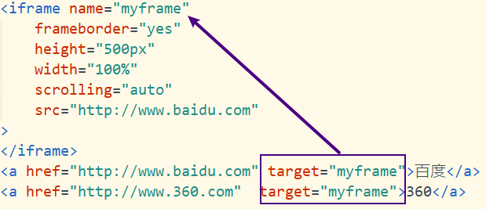

# Note 240619

## Review

### HTML
- form
  - method的设定
    - 取值范围
      - get:声明本次请求的目的是从服务器获取数据。
      - post：声明本次请求的目的是向服务器传送数据。
    - get与post的区别
      - 目的不同
      - 提交方式不同（一个在响应头，一个在响应体）
      - 提交数据长度不同，get：不超过255个字符，post理论上不受限制。
      - 安全性get在地址栏显示信息，不安全。
      - 缓存机制不同，get请求的地址会保存到浏览器的访问历史记录中，post不会
- iframe 框架标签
  - 属性
    - src:                 引用页面地址
    - name:                框架标识名
    - frameborder:         是否出现边框
    - scrolling:           是否出现滚动条
    - noresize:            是否允许调整框架窗口大小
    - width:                框架宽度
    - height:               框架高度
  - 

### CSS
- 语法
  - 内联样式
    - 内联样式（少用）:优点，直接作用在标签上  缺点：一段代码只能给一个标签用（如果多个标签一样的样式效果，就要重复写，造成代码冗余）
  - 内部样式
    - 内部样式（head中的style标签中）
  - 外部样式
    - `<link rel="stylesheet" type="text/css" href="css/mystyle.css">`
      - rel：这是一个必需属性，表示当前文档与被链接资源之间的关系。在引入CSS样式表时，rel的值通常为"stylesheet"，表示被链接的资源是一个样式表。
      - type：这个属性用于指定被链接资源的MIME类型。当rel="stylesheet"时，type的值通常为"text/css"，表示链接的是一个CSS样式表。
      - href：这个属性指定被链接资源的URL。它可以是相对路径，也可以是绝对路径。例如，href="styles.css"表示链接的样式表在与当前HTML文档相同的目录下，而href="http://www.example.com/styles.css"则链接到一个绝对URL。
- 选择器
  - 标签选择器
    - 直接用标签名：标签选择器  页面中所有的该标签 被选中 ，加上样式
  - 类选择器
    - 注意：前缀 点 (.类名)
  - id选择器
    - id选择器：注意点：前缀 # ,id是唯一的（由程序员自觉维护）
  - 属性选择器：通过属性和属性值选取元素。
    - `input[type="text"] {color: green;}` 将选取所有类型为"text"的`<input>`元素，并将它们的文本颜色设为绿色。
  - 后代选择器：
    - 后代选择器（也被称为包含选择器）可以选择某元素的后代元素。后代元素可以是子元素，也可以是子元素的子元素，以此类推。后代选择器使用空格 来表示。
      - `div p {color: red;}` 将选取`
`元素内部的所有`
`元素（不论`
`元素是否直接被`
`元素包含），并将它们的文本颜色设为红色。
  - 子元素选择器：
    - 子元素选择器只能选择作为某元素直接子元素的元素。子元素选择器使用大于号 > 来表示。
      - `div > p {color: blue;}` 将选取`
`元素直接包含的`
`元素（不选取`
`元素内部的其他后代元素），并将这些`
`元素的文本颜色设为蓝色。
  - 相邻兄弟选择器：
    - 相邻兄弟选择器可以选择紧接在某元素后面的、具有相同父元素的元素。相邻兄弟选择器使用加号 `+` 来表示。
    - 例如，`h1 + p {color: green;}` 将选取紧接在`<h1>`元素后面的、与`<h1>`元素具有相同父元素的第一个`
`元素，并将这个`
`元素的文本颜色设为绿色。
  - 兄弟选择器：
    - 兄弟选择器可以选择某元素之后的所有同级元素（即它们有相同的父元素）。通用兄弟选择器使用波浪号 `~` 来表示。
      - `h1 ~ p {color: orange;}` 将选取所有在`<h1>`元素之后的`
`元素，并将这些`
`元素的文本颜色设为橙色。
  - 通用选择器
    - 在CSS中是用来匹配页面中的任何元素的。它的符号是星号（*）。
    - 可以和其他选择器搭配使用
  - 群组选择器（Grouping Selector）
    - 在CSS中是用来将几种选择器的样式规则进行合并的。群组选择器使用逗号 `,` 来分隔各个选择器。
    - 规则的样式是完全相同的。为了避免重复，我们可以使用群组选择器将它们合并
  - 子串匹配属性选择器
    - CSS选择器的一种，它可以根据属性值的部分内容来选择元素。有三种类型的子串匹配属性选择器：
      - `[attr^=value]`：这个选择器会选择attr属性的值以value开头的所有元素。
      - `[attr$=value]`：这个选择器会选择attr属性的值以value结尾的所有元素。
      - `[attr*=value]`：这个选择器会选择attr属性的值中包含value的所有元素。
  - 伪类选择器
    - CSS选择器的一种，它用来选择处于特定状态的元素，例如鼠标悬停状态、已访问状态等。以下是一些常见的伪类选择器：
      - `:hover`：当用户的鼠标悬停在元素上时，该元素会被选中。
        - 适用于所有标签
      - `:active`：当用户点击或触摸元素时，该元素会被选中。
      - `:focus`：当元素获得焦点时，例如通过点击或键盘导航，该元素会被选中。
      - `:visited`：当链接已被用户访问过，该链接会被选中。
      - `:link`：可以选中所有未被访问的链接。
      - `:first-child`：可以选中某个元素的第一个子元素。
      - `:last-child`：可以选中某个元素的最后一个子元素。
      - `:nth-child(n)`：可以选中某个元素的第n个子元素。
  - 优先级 (权重)
    - id (权重值:100) > class(权重值:10) > 标签(权重值:1)
    - 权重值 
      - `:hover`的权重为 20
      - 子串匹配属性选择器 的权重为 5
      - 权重值是会叠加的
- `
` 最纯粹的块元素 