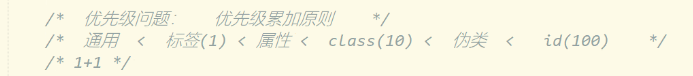
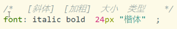
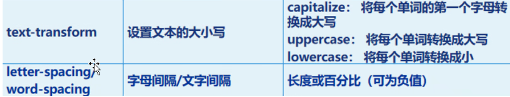

# Note 240620

## Review
- 

### CSS
- 字体样式
  - font
    - font-size 
      - 字体大小 : 默认 16px
    - font-weight
      - 100~500 不加粗
      - 600-900 加粗
      - bolder 与 dold 一样
    - font-family
      - 字体类型
    - font-style
      - 字体风格 : 斜体
        - italic
    - font
      - 
- 文本样式
  - color
    - 字体颜色
  - text-align
    - 设置元素水平对齐方式
  - text-indent
    - 设置首行文本的缩进
      - 单位可以是: px
  - line-height
    - 设置文本的行高
      - 行高 = 字体高度 + 行间距
  - text-decoration
    - 设置文本的装饰
      - overline 上划线 
      - line-through 删除线  
      - underline 下划线  
      - none取消划线
  - 了解
    - 
- 鼠标 (cursor)
  - default : 默认光标
  - pointer : 超链接的指针
  - wait : 指示程序正在忙
  - help : 指示可用的帮助
  - text : 指示文本
  - crosshair : 鼠标呈现十字状
- 背景样式
  - 背景颜色      background-color
  - 背景图像      background-image
    - 背景图片 url 指向地址
      - `background-image:url(img/zhuozi.jpg)`
  - 背景重复方式  background-repeat
    - no-repeat : 不重复
    - repeat-x : 水平方向重复
    - repeat-y : 垂直方向重复
  - 背景定位      background-position
    - 第一个值 :代表水平方向 
      - left , center , right 
    - 第二个值 : 垂直方向(默认居中)
      - top
      - center
      - bottom
    - 值不一定要用单词 还有可以用 像素 和 百分比
      - 参照点 : 左边 上边
    - 都没写默认在左上
  - 背景图片大小 : background-size 
- 列表样式
  - `list-style-type:none;` 无标记符号
  - `list-style-type:disc;` 实心圆，默认类型
  - `list-style-type:circle;` 空心圆
  - `list-style-type:square;` 实心正方形
  - `list-style-type:decimal` 数字
  - `list-style-image: url(images/arrow-icon.gif);` 在左侧列表显示图标
  - `list-style-position:outside/inside;`
    - `list-style-position: outside;` 是默认值。它将列表项目符号放在列表项内容的外部，这意味着列表符号与列表项内容是分开的，列表符号在列表项内容的左侧。如果列表项内容换行，新的一行将从列表符号的右侧开始。
    - `list-style-position: inside;` 将列表项目符号放在列表项内容的内部，这意味着列表符号与列表项内容在同一行，列表符号在列表项内容的左侧。如果列表项内容换行，新的一行将从页面边缘开始，不会在列表符号的右侧开始。
- 盒子模型
  - 内边距 padding
    - padding是4个方向的
    - 方法有两种
      - 小属性的写法：
        - padding-top: ;
        - padding-right: ;
        - padding-bottom: ;
        - padding-left: ;
      - 综合属性的写法：(上、右、下、左)（顺时针方向，用空格隔开。margin的道理也是一样的）
        - 如果写了四个值，则顺序为：上、右、下、左。
        - 如果只写了三个值，则顺序为：上、右和左、下。
        - 如果只写了两个值，则顺序为：上和下、左和右。
  - 边框 border
    - 是4个方向的
    - 边框有三个要素：像素（粗细）、线型、颜色。
      - border-width、border-style、border-color。
  - 外间距 margin 
  - 小属性的写法：
    - margin-top: ;
    - margin-right: ;
    - margin-bottom: ;
    - margin-left: ;
    - 特殊:
      - `margin : outo;` 水平居中
  - 综合属性的写法：(上、右、下、左)（顺时针方向，用空格隔开。margin的道理也是一样的）
    - 如果写了四个值，则顺序为：上、右、下、左。
    - 如果只写了三个值，则顺序为：上、右和左、下。
    - 如果只写了两个值，则顺序为：上和下、左和右。
- 块元素
  - 块元素可以设置 高度 和  宽度  
  - 默认   宽度 百分百 （相对于上级元素留给它的空间）   可以设置宽度
  - 默认  高度 是  0  或 由内容决定					可以设置高度
  - `
` 最纯粹的块标签
- 行内元素
  - 不能设置高度和宽度  （只能由内容决定）
  - `` 最纯粹的行内标签
- 行内块元素：  
  - 既有 共享一行的效果 又有 设置高度宽度的效果

### 沧水
- https://kms.cangshui.net/
