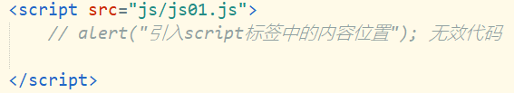
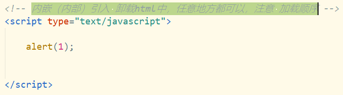
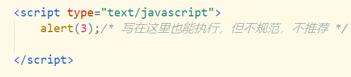
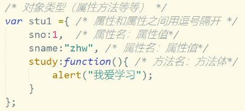
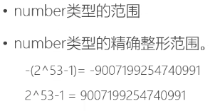
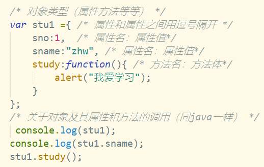
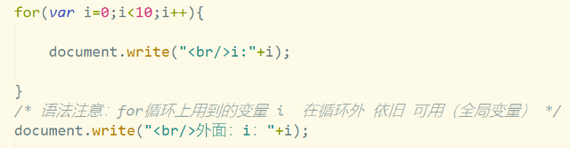

# Note 240624
## Review
- 在 Java 中 
  - 声明一个数组变量，但不直接初始化： `int[] arrayName;`
  - 声明并初始化数组： `int[] arrayName = new int[5];`
  - 声明并初始化数组，同时指定元素值： `int[] arrayName = {1, 2, 3, 4, 5};`
- SQL 的不等于写法 `< >`
### JavaScript
- 注意 : 
  -  `""` 里面不能再放 `""` 要用 `''`
  - 有循环的地方,要确定有出口,不会造成死循环
- DOM
- 引入方式
  - 外部js文件的引入，注意 引入的script标签 中间（内容）不能在写任何js代码了，否则内容部分的js代码会失效
    - 
  - 内嵌（内部）引入 卸载html中，任意地方都可以，注意 加载顺序
    - 
  - 在事件中编写javascript(不推荐)。
    - 
- 方法
  - `alert()` 消息弹窗
  - `typeof()` 数据类型
  - `document.write()` 页面就是 文档 ，write写 在页面中写
  - `Windows.prompt()` 输入弹出框
- 声明和数据类型
  - var 声明
    - 例如 `var a = 1;`
  - 实际的类型,由内容决定
  - 通过逗号的方式 ` , ` 的方式,一次性可以声明多个变量
  - 关于 声明的一些问题 
    - 声明未赋值 , 不会报错会显示 undefined
    - 不声明直接赋值,没问题,但是不规范
    - 未声明未赋值直接用
      - 浏览器报错 -> `ReferenceError: 某某 is not defined`
    - JS 的 数据类型不一样的话,变量名可以重复
- 命名规范 (与 Java 一样严格区分大小写)
  - 由 数字 字母 下划线 $组成
  - 不能以数字开头
  - 不能和关键字重名
  - 见文思意
- 书写规范
  - 结束的时候 , 分号可以不写 , 但是不规范
- 变量
  - JavaScript有6种数据类型：
    - 数字，布尔，字符串，null，undefined，对象。
  - 数据类型分类：
    - 基本数据类型 
    - 对象类型
      - `var a = null;` a 是 Object 类型
      - 
    - Number 类型
      - 
      - 内置函数
        - 通过内置函数
          - parseInt函数用于将字符串转换为整数。
          - 当你有一个包含数字的字符串，并且你需要使用这个数字进行数学运算时，你可以使用parseInt函数。这个函数尝试将一个字符串参数转换为整数（base-10）。如果字符串参数不能被转换为一个数字，那么它将返回NaN。
              - `parseInt('字符',进制数);`
              - `parseFloat('字符',进制数);`
              - 从字符串的第一个有效数字开始到第一个无效字符结束的内容进行数字转换。
              - 对于无有效数字则返回NaN类型(Not A Number);
          - number类型其他取值
            - NaN：非数字。当执行parseInt无有效数字时返回
            - Infinity：无穷。当超过浮点类型最大范围时
    - String 类型
      - 转义字符 在 `alert()` 以及 `console.log()` 中可以使用
      - 字符串的比较 `==` 
        - `'1'==1`的结果是true 
        - `'1' === 1` 的结果是 `flase` 因为 === 也会判断类型 
   - Object 类型
    - 
- 分支结构
  - 三目运算符
  - if(){} else{}
  - switch(){case :}
- 循环结构
  - for 循环
    - 在 JS 中要注意 i 是全局变量
      - 
  - while 循环
  - do...while 循环