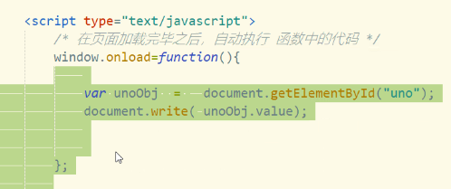
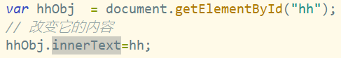

# Note 240625
## Review 
- `window.confirm("")` 确认弹出框

### JavaScript
- `function` 函数
  - 函数在定义前后都可以调用
  - 函数名对了,参数个数多了,一样可以调用
  - 函数名对了,参数个数少了,显示 undefined
  - 如果在一个HTML文件的<script>标签中定义了一个函数，那么这个函数在该HTML文件的全局作用域中是可用的。这意味着你可以在同一个HTML文件的其他<script>标签中调用这个函数。
- 递归
  - 优点 : 简化代码 
  - 缺点 : 逻辑性强
  - 关键是:找到公式(规律)
- 方法
  - 当页面执行完毕才执行代码
    - `window.onload = function (paramter){}` 
      - 
- DOM
  - DOM 是 Document Object Model（文档对象模型）的缩写。它是一种编程接口，用于HTML和XML文档。DOM将文档解析为一个由节点和对象（包括文本、标签、属性等）组成的结构体系，使得编程语言（如JavaScript）可以操作和更新文档的内容、结构和样式。
  - 在DOM模型中，文档被解析为一个树形结构，称为DOM树。DOM树的每一个部分都是一个节点。有几种不同类型的节点，包括元素节点（对应HTML标签）、文本节点（对应HTML中的文本内容）、属性节点（对应HTML标签的属性）等。
  - JavaScript可以使用DOM API来访问和操作DOM树，例如添加、修改或删除节点。这是动态网页（即网页内容在加载后仍可以改变的网页）的基础。例如，当你在网页表单中输入信息，点击按钮提交表单，或者点击展开一个下拉菜单时，可能就会用到JavaScript操作DOM的功能。
    - `getElementById()`方法是Document对象的方法，用于通过元素的id属性获取文档中的特定元素。该方法通常用于从HTML文档中获取具有特定id属性的元素，并允许您在JavaScript中操作该元素。
    - innerText属性用于获取或设置指定元素的文本内容，不包括任何HTML标记。innerText属性返回表示元素的文本内容的字符串，其中包含元素的所有文本内容，但不包括任何HTML标记。
    - 
    - getElementById()方法获取具有特定id属性的元素，然后使用innerText属性获取该元素的文本内容并将其存储在变量textContent中。
    - 请注意，与innerText属性类似的还有textContent属性，它也用于获取和设置元素的文本内容，但它会返回元素及其所有后代元素的文本内容，包括隐藏元素。innerText属性则只返回可见文本内容。
- BOM
  - BOM提供了与浏览器窗口进行交互的能力，而不仅仅是页面文档。它可以处理浏览器窗口和框架，但不涉及页面内容。例如，可以使用BOM来移动窗口、改变状态栏文本或者创建新的窗口。
  - BOM的主要对象包括：
      - Window：代表浏览器窗口，是JavaScript BOM的顶级对象，提供了诸如alert()、setTimeout()等方法。
      - Navigator：包含有关浏览器的信息。
      - Screen：提供了有关用户屏幕的信息。
      - Location：提供了有关当前URL的信息，并提供了一些导航功能。
      - History：提供了浏览器历史的信息，并提供了一些导航功能。
  - 需要注意的是，DOM和BOM都是JavaScript在客户端运行时的部分，它们使得JavaScript有能力与浏览器窗口以及其加载的文档进行交互。
- Math
  - 几个方法
    - `Math.round(x)`: 返回最接近的整数，如果小数部分大于等于0.5则向上取整，否则向下取整。
    - `Math.floor(x)`: 向下取整，返回小于或等于一个给定数字的最大整数。
    - `Math.ceil(x)`: 向上取整，返回大于或等于一个给定数字的最小整数。
    - `Math.abs(x)`: 返回一个数字的绝对值。
    - `Math.min(x, y, z, ..., n)`: 返回给定数字中的最小值。
    - `Math.max(x, y, z, ..., n)`: 返回给定数字中的最大值。
    - `Math.random()`: 返回一个介于0（包含）和1（不包含）之间的随机数。
    - `Math.sqrt(x)`: 返回一个数字的平方根。
    - `Math.pow(x, y)`: 返回 x 的 y 次幂。
    - `Math.PI`: 返回圆周率（约等于3.14159）。
    - `isNaN("")`: 是否为 非数字  not a number
    - `parseInt("123.123")`: 用于将一个字符串转换为整数
    - `parseFloat("123.123")`: 用于将一个字符串转换为浮点数
- String
  - 方法
    - `charAt(index)`: 返回指定位置的字符。
    - `concat(str1, str2, ..., strN)`: 连接两个或多个字符串，并返回新的字符串。
    - `includes(searchString, position?)`: 检查一个字符串是否包含在另一个字符串中，返回 true 或 false。
    - `indexOf(searchValue, fromIndex?)`: 返回指定值在字符串中首次出现的索引，如果没有找到则返回 -1。
    - `lastIndexOf(searchValue, fromIndex?)`: 返回指定值在字符串中最后出现的索引，如果没有找到则返回 -1。
    - `replace(searchFor, replaceWith)`: 在字符串中查找匹配的子串，并替换与该子串匹配的部分。
    - `slice(startIndex, endIndex?)`: 提取字符串的一部分，并在新的字符串中返回被提取的部分。
    - `split(separator, limit?)`: 把字符串分割为子字符串数组。
    - `substring(startIndex, endIndex?)`: 提取字符串中两个指定的索引号之间的字符。
    - `substr()` 是 String 对象的一个方法，它用于提取字符串的一部分并返回新的字符串。
       - `substr()` 方法接受两个参数： 
         - start：开始提取字符的位置。第一个字符的索引为 0。如果这个参数是负数，那么它会从字符串的尾部开始计算。
         - length（可选）：提取的字符数。如果省略或者提取的字符数超过了字符串的长度，那么将提取从 start 位置开始直到字符串的末尾的所有字符。
    - `toLowerCase()`: 把字符串转换为小写。
    - `toUpperCase()`: 把字符串转换为大写。
    - `trim()`: 去除字符串两端的空白字符。
- 数组
  - 注意:
    - 数组可以自动扩容 `var arr = new Array(3);arr[3]=666;` 这个代码是可以的
- 正则
    - 数字：`^[0-9]*$`
    - n位的数字：`^\d{n}$`
    - 至少n位的数字：`^\d{n,}$`
    - m-n位的数字：`^\d{m,n}$`
  - 常用 :
    - `^`：匹配输入字符串的开始位置。如果设置了 RegExp 对象的 Multiline 属性，^ 也匹配 '\n' 或 '\r' 之后的位置。
    - `$`：匹配输入字符串的结束位置。如果设置了 RegExp 对象的 Multiline 属性，$ 也匹配 '\n' 或 '\r' 之前的位置。
    - `.`：匹配除 "\n" 之外的任何单个字符。
    - `*`：匹配前面的子表达式零次或多次。
    - `+`：匹配前面的子表达式一次或多次。
    - `?`：匹配前面的子表达式零次或一次。
    - `\d`：匹配一个数字字符。等价于 [0-9]。
    - `\D`：匹配一个非数字字符。等价于 [^0-9]。
    - `\w`：匹配包括下划线的任何单词字符。等价于[A-Za-z0-9_]。
    - `\W`：匹配任何非单词字符。等价于 [^A-Za-z0-9_]。
    - `\s`：匹配任何空白字符，包括空格、制表符、换页符等等。等价于 [ \f\n\r\t\v]。
    - `\S`：匹配任何非空白字符。
    - `[abc]`：匹配方括号内的任何字符。
    - `[^abc]`：匹配方括号内的任何字符的补集。
    - `(pattern)`：匹配 pattern 并获取这一匹配。
- 日期对象 Date
  - 常用的get方法：
    - `getDate()`：获取日期对象中的日期（1-31）。
    - `getMonth()`：获取日期对象中的月份（0-11）。
    - `getFullYear()`：获取日期对象中的年份（四位数）。
    - `getHours()`：获取日期对象中的小时数（0-23）。
    - `getMinutes()`：获取日期对象中的分钟数（0-59）。
    - `getSeconds()`：获取日期对象中的秒数（0-59）。
    - `getDay()`：获取日期对象中的星期几（0-6，0代表星期日）。
    - `getTime()`方法用于获取日期对象的时间戳。
      - 时间戳是一个数字，表示自1970年1月1日 00:00:00 UTC（世界标准时间）以来经过的毫秒数。
      - `getTime()`方法返回的时间戳是一个长整型数字，可以用于比较日期对象之间的时间差或进行时间计算。
  - 常用的set方法：
    - `setDate()`：设置日期对象中的日期（1-31）。
    - `setMonth()`：设置日期对象中的月份（0-11）。
    - `setFullYear()`：设置日期对象中的年份（四位数）。
    - `setHours()`：设置日期对象中的小时数（0-23）。
    - `setMinutes()`：设置日期对象中的分钟数（0-59）。
    - `setSeconds()`：设置日期对象中的秒数（0-59）。
  - toLocaleString()方法用于将日期对象转换为本地时间的字符串表示形式。这个方法会根据浏览器的语言环境和地区设置，将日期对象转换为符合当地习惯的日期和时间格式。
