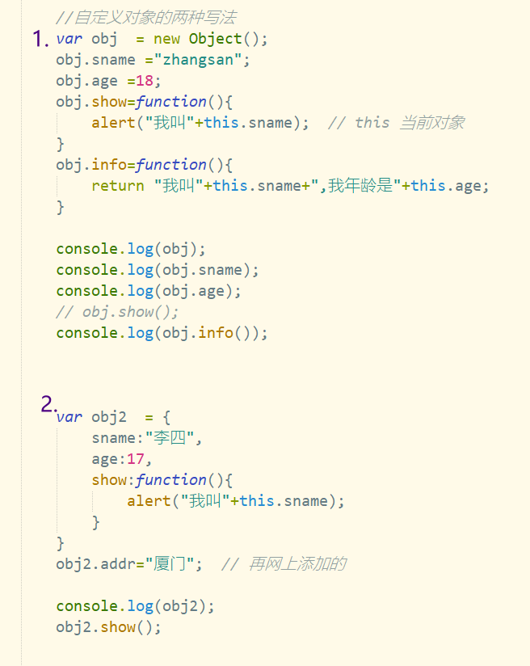
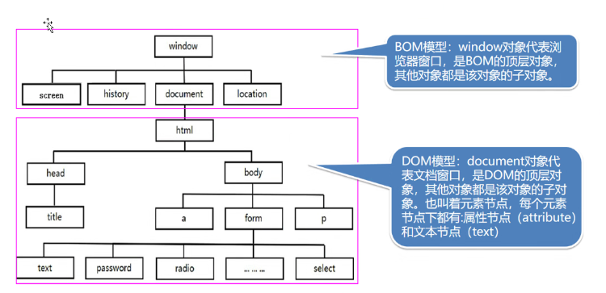
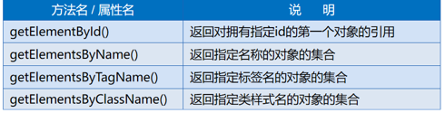
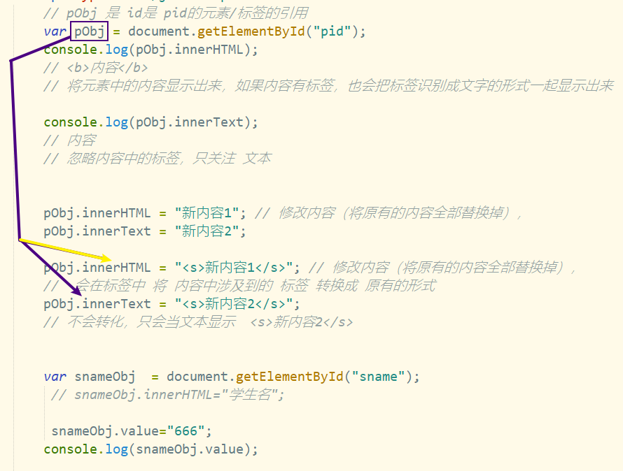
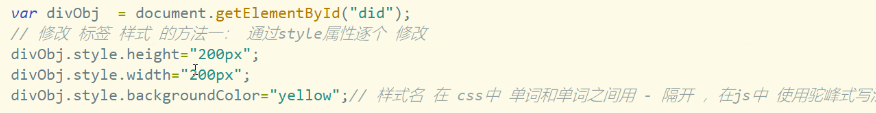
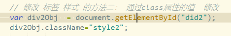
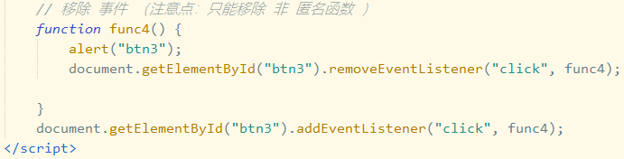
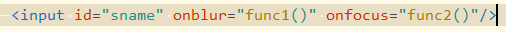
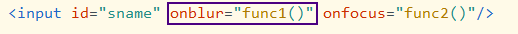

# Note 240626

## Review
- `window.onload=function(){  //当页面加载完毕之后，再执行（防止部分标签未加载的时候，js找不到）}`
### JavaScript
-  debugger
  - 在 JavaScript 中 进行单点调试 在浏览器中右键检查
- 自定义对象
  - 
- DOM 和 BOM
  - 
  - DOM
    - 
      - JS中可以通过document对象的一组方法，按照HTML元素的id值、name值、标记名或使用的类样式来获得指定的（一组）DOM元素。
      - 其中除了getElementById（）返回特定的DOM元素，其他3个方法都返回包含对应DOM元素的数组。
      - 使用document对象的方法获得DOM对象
      - 注意：Js要在DOM加载后执行，否则会得到undefined
    - `var pObj = document.getElementById("pid");` pObj 是 id是 pid的元素/标签的引用
    - `pObj.innerHTML` 会在标签中 将 内容中涉及到的 标签 转换成 原有的形式
    - `pObj.innerText` 不会转化，只会当文本显示  <s>新内容2</s>
    - 
    - DOM 的几种选择器
      - `document.getElementById(id)`: 这个方法返回文档中具有指定ID的元素。这是最常用的选择器，因为ID在HTML文档中是唯一的。
      - 获得的是数组
        - `document.getElementsByClassName(className)`: 这个方法返回文档中所有具有指定类名的元素的集合。它返回的是一个类数组的对象。
        - `document.getElementsByName(name)`getElementsByName方法可以获取所有与指定名称匹配的元素集合。这个方法返回的是一个类数组的NodeList对象。
        - `document.getElementsByTagName(tagName)`: 这个方法返回文档中所有指定HTML标签的元素的集合。
      - Selector
      - `document.querySelector(selector)`: 这个方法返回文档中匹配指定CSS选择器的第一个元素。这是一种非常强大的选择器，因为它可以使用复杂的CSS选择器来获取元素。
      - `document.querySelectorAll(selector)`: 这个方法返回文档中匹配指定CSS选择器的所有元素的集合。
    - 获得元素属性
      - 通过 style 属性逐个改
        - 样式名 在 css 中 单词之间用 - 隔开 , 在 js 中用 驼峰式写法
        - 
      - 通过 class 属性的值修改
        - 
    - 事件
      - 绑定事件
        - 内联事件处理器（Inline Event Handlers）：这是最初级的事件绑定方式，直接在HTML元素中使用事件属性（如onclick，onload等）来绑定事件处理函数。
          - 例如: `    <button onclick="alert('Hello, World!')">Click Me</button>`
        - DOM0级事件处理器（DOM0 Level Event Handlers）：这种方式是在JavaScript代码中，直接将函数赋值给元素的事件处理器属性。
          - 例如： `    var btn = document.getElementById('myButton');
            btn.onclick = function() {
            alert('Hello, World!');
            };`
        - DOM2级事件处理器（DOM2 Level Event Handlers）：这种方式使用addEventListener（或在IE8及以下版本中使用attachEvent）方法来绑定事件处理函数。
          - 例如： `    var btn = document.getElementById('myButton');
            btn.addEventListener('click', function() {
            alert('Hello, World!');
            });`
          - 这种方式的优点是可以为同一种事件绑定多个处理函数，而且它还提供了更多的选项，如指定事件是否在捕获阶段或冒泡阶段处理。
      - 解除绑定
        - DOM2级事件处理器（DOM2 Level Event Handlers）：对于DOM2级事件处理器，我们可以使用removeEventListener（或在IE8及以下版本中使用detachEvent）方法来解绑事件处理函数。
          - `    var btn = document.getElementById('myButton');
            var handler = function() {
            alert('Hello, World!');
            };
            btn.addEventListener('click', handler);
            // 解绑事件处理函数
            btn.removeEventListener('click', handler);
            `
          - 
          - 注意，removeEventListener需要传入与addEventListener相同的参数，包括事件类型和事件处理函数。这意味着你不能解绑匿名函数，因为你无法提供一个引用来匹配它。所以在使用addEventListener时，最好使用具名函数或将匿名函数赋值给一个变量，以便于以后解绑。
        - 内联事件处理器（Inline Event Handlers）：对于内联事件处理器，我们可以直接在HTML中删除相关的事件属性，或者在JavaScript中将其设置为null。
          - `    <button id="myButton" onclick="alert('Hello, World!')">Click Me</button>
                 
            `
        - DOM0级事件处理器（DOM0 Level Event Handlers）：对于DOM0级事件处理器，我们可以在JavaScript中将事件处理器属性设置为null。
          - `    var btn = document.getElementById('myButton');
            btn.onclick = function() {
            alert('Hello, World!');
            };
            // 解绑事件处理函数
            btn.onclick = null;
            `
      - 焦点
        - 焦点 获得 与 失去
          - 当用户与页面上的可交互元素（如输入框、按钮）进行交互时，这些元素会获得或失去焦点。我们可以使用特定的DOM事件来监听元素的焦点变化。
          - onfocus：当元素获得焦点时，会触发onfocus事件。例如，当用户点击一个输入框或使用Tab键导航到一个按钮时，这个元素就会获得焦点，从而触发onfocus事件
            - 我们可以使用onfocus属性或addEventListener方法来为元素添加focus事件处理函数。
              - 
              - `    var input = document.getElementById('myInput');
                input.addEventListener('focus', function() {
                console.log('Input got focus');
                });
                `
          - onblur：当元素失去焦点时，会触发onblur事件。例如，当用户从一个输入框中点击出来或使用Tab键导航离开一个按钮时，这个元素就会失去焦点，从而触发onblur事件。
            - 我们可以使用onblur属性或addEventListener方法来为元素添加blur事件处理函数。
              - 
              - `    var input = document.getElementById('myInput');
                input.addEventListener('blur', function() {
                console.log('Input lost focus');
                });
                `
      - 鼠标事件
        - click : 多用在某个对象控制地范围内地鼠标点击后抬起事件。
        - dblclick : 鼠标双击事件触发的事件。
        - mousedown : 鼠标上地按钮被按下时触发的事件。
        - mouseup : 鼠标按下后，松开时激发的事件
        - mouseover : 鼠标移动到某对象范围地上方时触发的事件
        - mousemove : 鼠标移动时触发的事件。
        - mouseout : 鼠标离开某对象范围时触发的事件。
        - mousewheel ：鼠标滚轮滚动式触发的事件。
        - contextmenu：鼠标右键菜单弹出前触发的事件。

