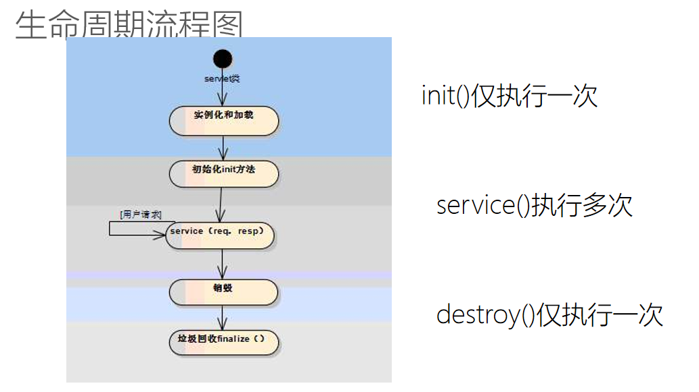

# Note 240628

## Review

### servlet
- 生命周期
  - 
  - 
- get 方式
  - 使用get的方式，会将相关的提交信息，显示在地址栏中(安全性问题)
  - 页面提交:
    - 报文:带着相关数据 传到后台
    - 请求头:还有 地址栏以及get方式提交的数据参数请求体:放的一下相关配置信息 (会显示在地址栏)
    - 请求体: 相关配置信息
    - 空格: 把头 和 体 隔开
    - 消息体:post请求一些数据，可以昔通文本也可以是文件等等保证隐私或者大文件，通常通过消息体传递
- 调用 servlet 中的 doGet 方法
  - 在地址栏中直接输入地址，访问:是get方法提交
  - a标签跳转:地址中有相关的参数信息 是 get方法提交
  - form 表单提交中 method="get" 是get万法提交
- 调用 servlet 中的 doGet 方法
  - form 表单提交中 method="post”方式:是post方式提交
- 中文乱码问题
  - 
- 浏览器重定向
  - 
### JSP
- `<%  %>` JSP 元素 小脚本 可以用来写 Java代码
- `<%=  %>` 相当于 out.print()  是 输出
- 
### Tomcat